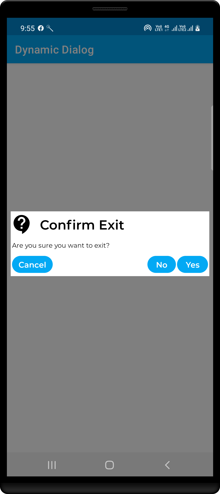
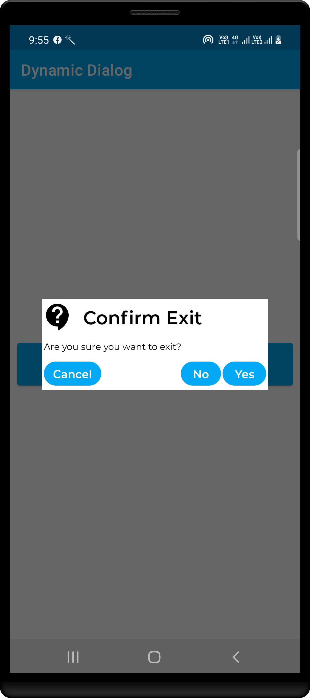

# Java - DynamicDialog #

Let DynamicDialog support

- Only set layout that it, dialog is created
- Listener

- setOnCancelListener
- setOnDismissListener
- setOnKeyListener
- setOnClickListener
- setOnLongClickListener

|       apply attribute true        |      apply attribute false        |
|-----------------------------------|-----------------------------------|
|  |  |

## Author ##

Rohit Yadav

[rohitnotes24@gmail.com](mailto:rohitnotes24@gmail.com)

[http://badasoftware.com/](http://badasoftware.com/)
